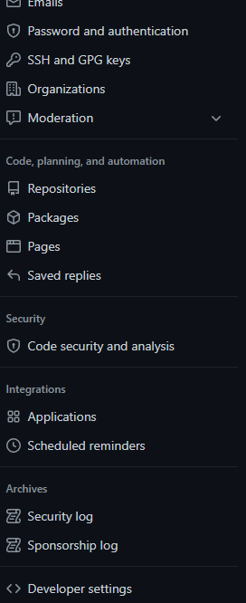
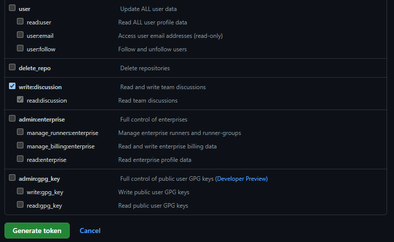

# Setting up the repo and access to the repo

In order to do anything with Github, we obviously need a repo to monitor and publish PRs in.  
We will also need a token so that the bot can work on that repo.  
The bot will have access to quite a lot on the repos on your Github account. It won't do anything bad, but if you prefer erring towards the side of caution, feel free to use a less important account.

## Opening a new repo

On your account open a new public repo.  
Then put its name in tokens.py (open it with `tokens.py`{{open}}), on the def_repo_name field.  
This name will be the default repo name for the rest of the tutorial.

## Adding the Github token

We will need a Github token for the bot to manage the PRs on the repo.   

You'll need to paste your Github token in tokens.py (`tokens.py`{{open}}), inside the Github() function of the g variable.

In order to get the token, go to your Github's account settings, and choose Developer settings (the last tab, as such:)  
  
There, go to Personal access tokens and Generate a new token.  
Make sure to give appropriate authorisations and **do not share it, and delete after this tutorial if you don't need it anymore**  
For example:  
  
and
  
We use repo to handle our repos. Feel free to put a shorter expiration if you don't want it to last (or just delete it yourself at the end).

**This will handle your whole account, so make sure you know what you are doing in terms of authorisations**

Copy it immediately into the code, as you won't be able to see it afterwards.

## Validating step 1

We wrote this tutorial with Python, so we will need the API of Discord for Python.  
Add it to the environment with `pip install -U discord.py`{{execute}}.  
We also need a way to communicate with Github. For that we use `pip install -U PyGithub`{{execute}}  
You can check that the installation was successful with `pip list | egrep 'discord.py|PyGithub'`{{execute}}, which should tell you which version has been installed for **both** packages.  

In order to see if everything up to that point has been done successfully, we will try to create a new PR.  
Run `python3 create_PR.py`{{execute}} to do it.  
You should see a new PR in your repo.
