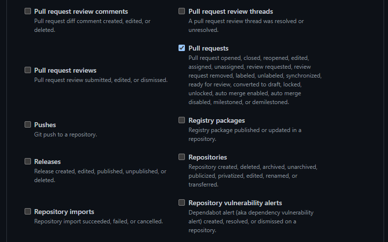
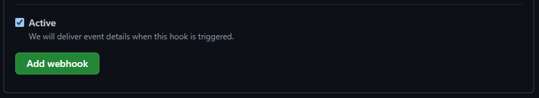

# Setting up the environment and webhooks

For this section the terminal and the editor will not be used, you will be asked to perform tasks in your browser.

## Setup

For the tutorial to function you will need a Discord server, and a Github repo which the bot will monitor.  
For this tutorial we will assume you know the basics of Discord and Github (creating a server/channel in the server, and how to open PRs, and so on).  
For the both of them, the web browser version should be enough.  

## Creating the webhook

The webhook is an url that will transmit information when some actions are performed on the repo. Discord is able to interpret that information and publish the information on what happened.  

We first need to tell Discord to create a webhook that Github will use to send information. For that, go to a channel in your server, and open its settings (the cogwheel when the channel is selected).  
Then navigate to integrations, and webhook, as such.  

Then create the webhook, give it a name and check if the channel it will publish on is the correct one (change it if that is not the case), and copy the webhook's URL.  
**Be careful if you are to set a webhook on an actual server: don't divulgate the URL as someone with it will be able to publish messages to the channel without being invited**  
Discord will now listen to what is said on that URL.  

## Publishing on the webhook

We now need to tell Github to publish information on that URL.  

Go to the settings page of your repo and select the webhook page as there.
  
There add a webhook. You will get the follwing window:
  
There, paste your url (`example_url.com` for our example), and add `/github` at the end.  
We will just look at the PRs for now, so make sure this is the only one checked, like this:  
  
And add the webhook.  

**Everything should now work!**

Feel free to try to add a PR to test it!

## But we can do more

You can see that this implementation is very basic. You could maybe filter what kind of event appears, but it will be difficult to do more complex things, like interacting with the repo from the channel, or changing the way the information is displayed in the message. So you can write your own bot! That is what we'll do in the next step!
