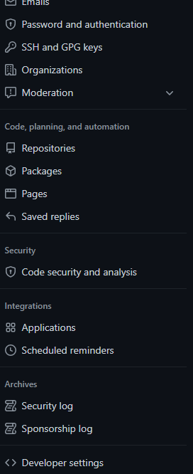
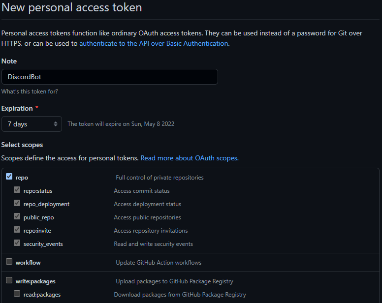
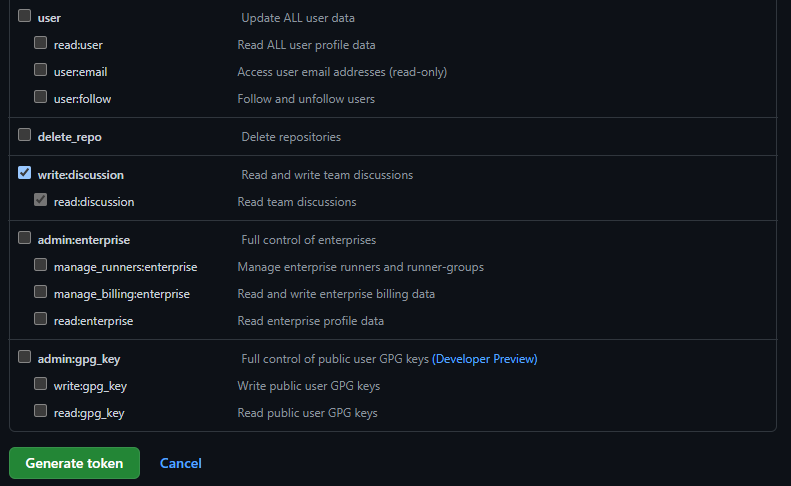

# Adding a custom Python bot

We now want to implement more implement more interaction, especially with PRs.  
*We chose PRs but if you read the documentation of the API, you can do a lot of other aspects!*  
For that, we want more than just displaying PRs as they come. We will focus on three aspects.
- Giving the list of currently opened PRs  
- Creating a new PR  
- Accepting or refusing a PR directly in Discord

For that we need more interaction between the bot and the repo.  
We'll thus create a bot written in Python that will be able to see what is done in the channel and act accordingly.  
In order to interact with the repo, we use the REST API of Github to tell the repo what to do.

## Creating a bot for your server

Now we're truly getting started! To create your bot account go to https://discord.com/developers/applications.  
Log in and create a new application, and once you have selected the name, go to the `Bot` tab and add a new bot.
Lower in the page you have permissions. There are the one we are using.  
  
They may not be all relevant to what you are doing, or you may need more to add more functionalities, so change them accordingly to what you want to do. Tick administrator for all of them, but be wary: the bot will be able to do anything, so if the bot token leaks, this may be very bad for the server!  
To invite your bot in your server, go to the `OAuth2` tab (just above the bot tab in the tab list).  
Tick the `bot` option in the `SCOPES` window, and add the pertinent permissions in the window below it. In our case it will be the same as for the bot itself (as the bot is the application).  
At the bottom of the page there is an url; it is the one used to invite a bot in your server. Copy it and open in your browser, and select the same server in which you created your webhook in the previous step, as we will use it for some functionalities.  

## Writing the bot

We write the bot in Python, so we need the API of Discord for Python. Add it to the environment with `pip install -U discord.py`{{execute}}.  
We also need a way to communicate with Github. For that we use `pip install -U PyGithub`{{execute}}
You can check that the installation was successful with `pip list | egrep 'discord.py|PyGithub'`{{execute}}, which should tell you which version has been installed for **both** packages.  

Open the code for our bot with `Bot_public.py`{{open}}.  
Feel free to already have a look at the code and see what you understand.  

You will need to change some things with information specific to your bot/repo:
- Your Github token for access to your repo
- Your bot's token

You'll need to paste your Github token at the start of the code (line 14), and the bot's token at the end of the code (line 102).  

In order to get the first one, go to your Github's account settings, and choose Developer settings (the last tab, as such:)  
  
There, go to Personal access tokens and Generate a new token.  
Make sure to give appropriate authorisations and **do not share it, and delete after this tutorial if you don't need it anymore**  
For example:  
  
and
  
We use repo to handle our repos. Feel free to put a shorter expiration if you don't want it to last (or just delete it yourself at the end).

**This will handle your whole account, so make sure you know what you are doing in terms of authorisations**

Copy it immediately into the code, as you won't be able to see it afterwards.

For the bot's token, go to the same page where you created the bot, go to its page and you will find its token there. Reset the token if necessary.  
Again, copy it immediately into the code, as you won't be able to see it afterwards unless you reset the token.  

**Again, make sure you keep it safe**  

Once this has been done, your bot is ready for use!  
But we'll first try to understand what it does.

## What is the bot doing?

We want to first focus on the `$help` command. Look at line 75. You see that the parent in the execution tree is the `on_message` function, which is a discord api function that is triggered when a message is sent on a channel in the server the bot is in. You see that if the content of the message is `$help`, then it sends a message with all the possible commands.

The behaviour is similar for other options in that function. For example, `$create_pr` will create a PR with the given attributes (base, head... Our default repo is `devops-course`, but do change it to your appropriate repo name).

It is easy to create new commands: we will give some an exercise once the rest of the code is clear.

We also have another big part of the code that is the `on_reaction_add` function. Can you guess what it does?

It reacts to reactions on the webhooks messages about the PRs. That is why we still use the webhook: otherwise, we won't be able to see "in real time" when a PR is made, we would need to query the repo for it.  
With a green tick, the PR is merged if it is possible, and with a red cross it is closed.  
Again it is very easy to add more scenarios based on what emoji is used to react.

## Running the bot

Now we'll run the bot! Use `python3 Bot_public.py`{{execute}} to run it.  
Play around with the different functionalities we talked about and see what they actually do! Create PRs, list them, react to them and so on. `$help` will give you a list of all possible commands (or maybe there is a *hidden* command...)

## Exercises

When you make a change to the bot, stop it and then rerun it to see the changes.

### First Exercise

Try to add a command! For example, for `$hello`, try to make the bot send the message `Hi @user!` that greets the user sending the command.

*Hint1: You need to add it alongside the other commands. The syntax will be very similar than the `$help` command*  
*Hint2: The user who sent the message is available in the data structure of the message. Explore the documentation to find where; we also already use it in our code, and you can explore how to address the person in particular with the given info*  

### Second Exercise

Try to add a new reaction! For example, if a user adds a question mark emoji as a reaction to a PR, add a comment to the PR saying "The PR needs more explanation on what it does".

*Hint1: Again take inspiration on what is currently done to accept PRs, and explore how do you make a comment to a PR in the REST Github API*  
*Hint2: Look at what issue comments are on a PR*  
*Hint3: You may need to add a new thing to publish on the webhook if you want the comments to show up with the hook*

### Third Exercise

Try to add a new function! There are lots of possibilities, and commands can be triggered on a lot of different events: a new person entering the server, or performing a specific action... You can even play with roles in the server thanks to bots, and thus deal with authorisations.

*Hint1: No hint there! Feel free to experiment with different things and to look online for inspiration*

### Easter easter

Have you found our easter egg?
