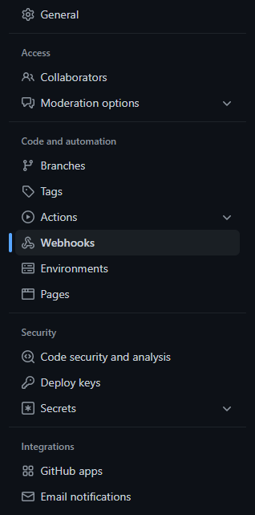

# Creating a functional webhook

## Explanation

The webhook is an url that could be considered as the "ears" of the Dicord server. Discord will be able to process anything "told" on that url and act accordingly (publishing the information).  
Thus Github will send information to that url,  and it will interpret this information and publish it

## Creating the webhook

We first need to tell Discord to create the webhook.  
Choose or create a Discord Server in which this tutorial will take place.
For that, go to a channel in your server, and open its settings (the cogwheel when the channel is selected).  
Then navigate to integrations, and webhook, as such.  

Then create the webhook, give it a name and check if the channel it will publish on is the correct one (change it if that is not the case), and copy the webhook's URL.  
**Be careful if you are to set a webhook on an actual server: don't divulgate the URL as someone with it will be able to publish messages to the channel without being invited**  
Discord will now listen to what is said on that URL.  

## Publishing on the webhook

We now need to tell Github to publish information on that URL.  

Go to the settings page of your repo and select the webhook page as there.
  
There add a webhook. You will get the follwing window:
  
There, paste your url (`example_url.com` for our example), and add `/github` at the end.  
Make sure to put the put the content type as json, as shown.  
We will just look at the PRs for now, so make sure this is the only one checked, like this:  
  
And add the webhook.  

**Everything should now work!**

## Validating step 2

Try to add a PR to test it!  
You can do it on your own or with a test PR with the following command : `python3 create_PR.py`{{execute}}
A message notifying you of the creation of a new PR should appear in your channel.

## But we can do more

You can see that this implementation is very basic. You could maybe filter what kind of event appears, but it will be difficult to do more complex things, like interacting with the repo from the channel, or changing the way the information is displayed in the message. So you can write your own bot! That is what we'll do in the next step!
