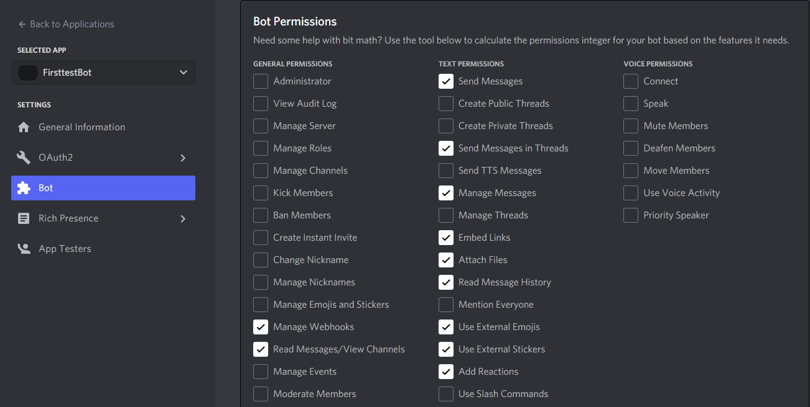

# Adding a custom Python bot

We now want to implement more implement more interaction, especially with PRs.  
*We chose PRs but if you read the documentation of the API, you can do a lot of other aspects!*  
For that, we want more than just displaying PRs as they come. We will focus on three aspects.
- Giving the list of currently opened PRs  
- Creating a new PR  
- Accepting or refusing a PR directly in Discord

For that we need more interaction between the bot and the repo.  
We'll thus create a bot written in Python that will be able to see what is done in the channel and act accordingly.  
In order to interact with the repo, we use the REST API of Github to tell the repo what to do.

## Creating a bot for your server

Now we're truly getting started! To create your bot account go to https://discord.com/developers/applications.  
Log in and create a new application, and once you have selected the name, go to the `Bot` tab and add a new bot.
Lower in the page you have permissions. There are the one we are using.  
  
They may not be all relevant to what you are doing, or you may need more to add more functionalities, so change them accordingly to what you want to do. Tick administrator for all of them, but be wary: the bot will be able to do anything, so if the bot token leaks, this may be very bad for the server!  
To invite your bot in your server, go to the `OAuth2` tab (just above the bot tab in the tab list).  
Tick the `bot` option in the `SCOPES` window, and add the pertinent permissions in the window below it. In our case it will be the same as for the bot itself (as the bot is the application).  
At the bottom of the page there is an url; it is the one used to invite a bot in your server. Copy it and open in your browser, and select the same server in which you created your webhook in the previous step, as we will use it for some functionalities.  

We will need the bot's token in our code so that it know which bot it represents:  
On where you created the bot, go to its page and you will find its token there. Reset the token if necessary.  
Copy it immediately into tokens.py (`tokens.py`{{open}}), as you won't be able to see it afterwards unless you reset the token.  

**Again, make sure you keep it safe**  

## Validating step 3

Make sure you've installed what was necessary in the previous step (`pip install -U discord.py`{{execute}} and `pip install -U PyGithub`{{execute}}, and `pip list | egrep 'discord.py|PyGithub'`{{execute}} to make sure both are installed)

Run the bot with `python3 Bot_public.py`{{execute}}.  
And then on your server use the following command `$help`.  
You should get a message from the bot listing (nearly) all the commands available in the server.  
We will explain how it works in the next step.  
You can open the code for our bot with `Bot_public.py`{{open}}.  
Feel free to already have a look at the code  already and see what you understand before we explain it.  
